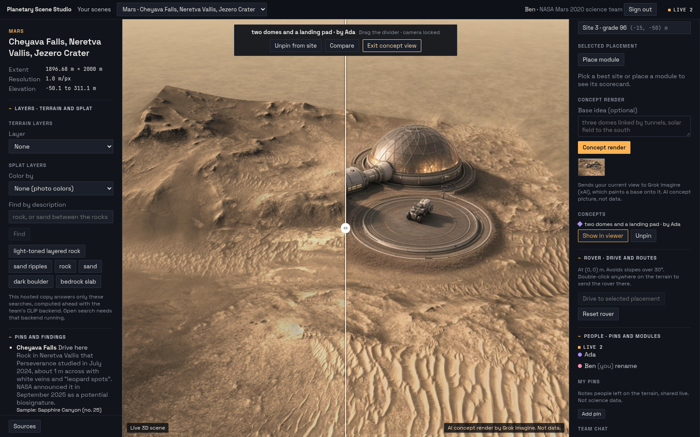
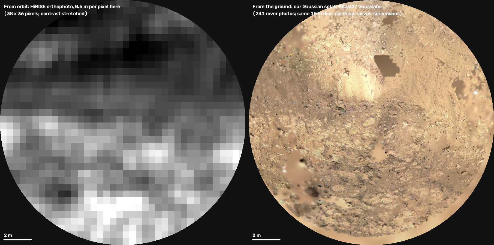
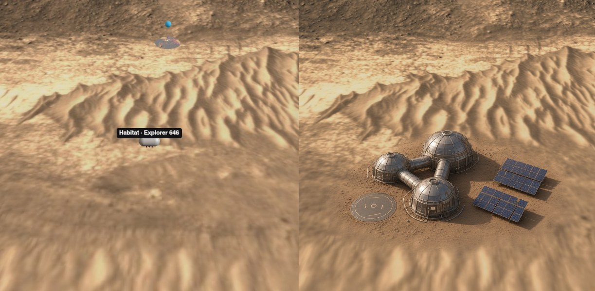

# Planetary Scene Studio

**Plan a base on Mars or the Moon, on the real ground, together.**

Live: **https://planetary-scene-studio.vercel.app** (access code in our Devpost submission)



From orbit, the sharpest pictures of Mars are 25 cm per pixel and the best elevation model is 1 m per pixel. A 30 cm rock is one pixel, and a rock that size decides whether a wheel, a landing leg or a habitat foundation works. NASA's rovers have photographed some places from the ground at millimetres per pixel, and those photos are public.

Planetary Scene Studio puts a photoreal, metric ground site built from rover photos onto real orbital terrain, then lets a mission team plan on it in one shared session.

## What you can do

| | |
|---|---|
| **Stand on the real ground** | A Gaussian splat of 972,047 Gaussians, trained from 241 Perseverance photos of Cheyava Falls in Jezero Crater, sits on 2 km of HiRISE terrain in the same metric frame. |
| **Read it as data** | Every Gaussian carries layers: terrain class (our model, trained on AI4Mars), roughness, height above the orbital model, and a visual cluster for text search. |
| **Cite the science** | The Cheyava Falls pin has 15 findings quoted from the Nature paper and NASA releases. Orbital mineral maps appear only where they have data. |
| **Plan a base** | A suitability map grades the terrain. Place habitats, domes and pads and get a scorecard. |
| **Drive a rover** | A six-wheel rocker-bogie rover follows the ground and the splat's own rocks at Perseverance's real top speed (4.2 cm/s), with time warp and an arrival clock. |
| **Imagine it with Grok** | Describe a base. We send your current 3D view to Grok Imagine, which paints the base onto that terrain and camera angle. Swipe between the real view and the concept, and read Grok's feasibility notes from the site's own scores. |
| **Talk to it** | Chat and voice go through Grok. It drives the rover, places pins, starts renders, and answers questions only from the scene's facts. |
| **Work together** | One access code signs you in to your organisation and shows only your scenes. Cursors, pins, modules, rover drives, team chat and each other's concept renders sync live through SpacetimeDB. |
| **Check the Moon** | Malapert Massif near the lunar south pole: sunlight and Earth visibility computed from LOLA terrain and JPL ephemerides, a radiation dose estimate, and a regolith shielding slider built on published values. |

## Why the small circle matters



Inside the 18 m site, orbit has 270 height samples and about 4,000 photo pixels. Our splat has 972,047 Gaussians. Orbit tells you where to look; the ground tells you what is there.



## How it is built

```
NASA rover photos + camera models ──► pipelines/data ──► gsplat (Colab A100) ──► scene bundle
USGS HiRISE, CRISM, LOLA, JPL DE421 ─► pipelines/data, pipelines/moon ────────────┘
                                                                                   │
browser: React + three.js + Spark (all 3D runs here) ◄── static files on Vercel ◄──┘
   │            │
   │            └──► one small function on Vercel ──► xAI Grok (Imagine, Voice, text)
   └──► SpacetimeDB (hosted): presence, pins, modules, rover, chat, concepts, access
```

- **Splat pipeline** (`pipelines/data`). No structure-from-motion. Rover images ship with JPL camera models (CAHVORE); we undistort them, take metric poses from rover telemetry, register three rover stops to within 2 pixels, and train with gsplat (MCMC). Every candidate was judged by rendering new viewpoints and looking at them.
- **Semantic layers** (`pipelines/semantic`). A SegFormer model trained on AI4Mars labels terrain in each rover photo. SAM regions embedded with CLIP give the search clusters. Both are lifted onto the Gaussians.
- **Moon** (`pipelines/moon`). Horizon, illumination and Earth visibility from LOLA terrain and JPL ephemerides.
- **Viewer** (`apps/web`). React, TypeScript, plain three.js, Spark for the splat.
- **Grok** (`apps/backend`). Imagine image-edit on the captured view, Voice for speech in and out, text for intents and grounded answers. The key stays on the server.
- **Planning.** Cursor for development; Grok Bot in our Slack for project planning and team collaboration.
- **SpacetimeDB** (`spacetime`). One TypeScript module is the only database: presence, pins, modules, rover state, team chat, shared concept renders (the pictures live in rows), organisations and per-scene access checked in every reducer.

## Honest limits

- Text search separates rocks from the ground between them. It does not tell rock types apart.
- The orbital mineral maps do not cover the rover site, and show no carbonate detection.
- The splat has holes where no photo covers the ground and is soft from closer than about 2 m. A rover sees about 10 m well; the limit is the data, not the method.
- Sign-in is organisation membership by access code, not personal login. Scene files are public static files.
- Concept renders, feasibility notes and the dose and terrain-class layers are labelled as AI output or estimates in the app. Every layer shows its source and resolution.

## Run it

```bash
# viewer
cd apps/web && npm ci && npm run dev              # http://localhost:5173

# backend (Grok routes, text search); put XAI_API_KEY in apps/backend/.env
cd apps/backend && python -m venv .venv && .venv/bin/pip install -r requirements.txt
SCENES_DIR=../../scenes .venv/bin/uvicorn main:app --port 8000

# shared session: see spacetime/README.md      deploy: scripts/deploy_vercel.sh
```

Scene bundles are not in git (about 50 MB). `pipelines/make_mars_bundle.sh` rebuilds the Mars one from a trained splat; the hosted site carries both.

## More

- `docs/devpost.md`: the submission write-up.
- `docs/contracts.md`: the file formats every part meets at.
- `docs/splat-pipeline.md`: what was built, and what was tried and rejected.
- `docs/data-sources.md`: every data source with its link.

Data: NASA/JPL-Caltech Mars 2020 raw images, USGS HiRISE DTM and orthomosaic, CRISM (PDS), Valantinas et al. mineral maps (Zenodo), LOLA, JPL DE421, Hurowitz et al. 2025 (Nature), Matthiä & Berger 2024 (Space Weather).

Built at MHacks by Matus, Claire and Humyra. We used Cursor to build it and Grok Bot in our team Slack to plan it and coordinate.
